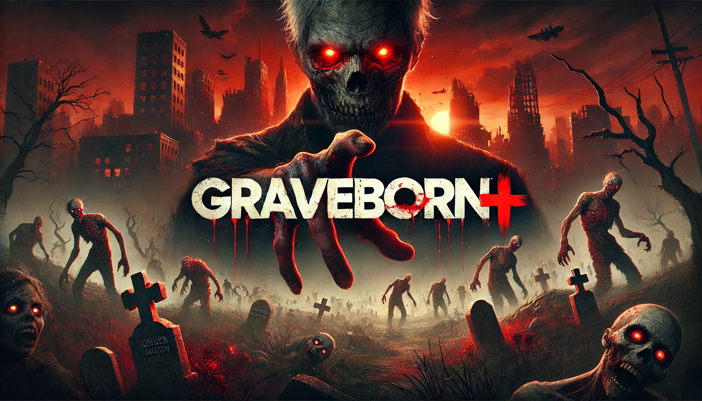

# Graveborn

[](https://github.com/fkoppe/graveborn/actions)

## Overview

Graveborn is a multiplayer game written in Java currently under early development.

## Getting Started

To get started with Graveborn, follow these steps:

### Prerequisites

- **Java Development Kit (JDK) 17**
- **Gradle** 6.0 or higher

### Installation

1. **Clone the repository:**
   ```bash
   git clone https://github.com/yourusername/graveborn.git
   cd graveborn
   ```
2. **Build the project:**
   ```bash
   ./gradlew build
   ```
3. **Run the game:**
   ```bash
   ./gradlew run
   ```

## Contributing

We appreciate your contributions to Graveborn! If you would like to contribute, please follow these steps:

### Recommended IDEs
- Visual Studio Code with the [Java Extension Pack](https://marketplace.visualstudio.com/items?itemName=vscjava.vscode-java-pack)
- [IntelliJ IDEA](https://www.jetbrains.com/idea/)
- Alternatively, you can use the [JMonkey SDK](https://jmonkeyengine.org/start/)

### Contribution Steps
1. **Fork the repository.**
2. **Create a new branch:**
   ```bash
   git checkout -b feature-branch
   ```
3. **Make your changes** and commit them:
   ```bash
   git commit -m 'Add new feature'
   ```
4. **Push to your branch:**
   ```bash
   git push origin feature-branch
   ```
5. **Create a pull request:** Go to the original repository on GitHub, navigate to the "Pull requests" tab, and click "New pull request". Select your branch to compare and create the pull request.

### Coding Standards
Ensure that your code follows the coding standards outlined in the [STYLEGUIDE.md](STYLEGUIDE.md) file.
