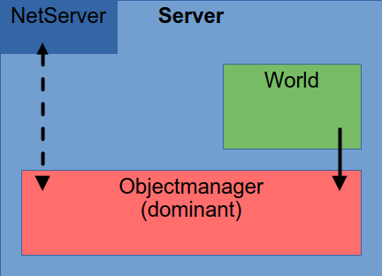
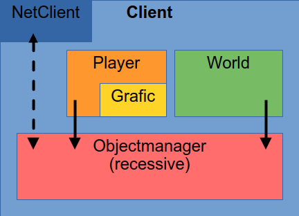
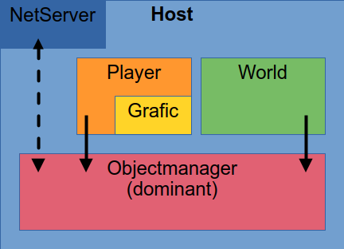
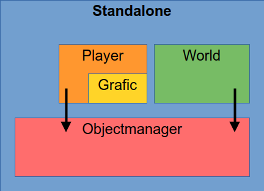
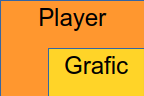
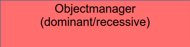
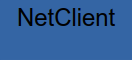

# Graveborn - Structure

## Modes

### Server

### Client

### Host

### Standalone

## Game

### Player

- is responsible for window settings
- is responsible for audio
- collects player input
- translates player input to Objectmanager updates
- submits Objectmanager updates

### World

- is responsible for npc movement
- is responsible for rewards and score
- calculates npc actions and position updates
- submits Objectmanager updates

### Objectmanager

- is responsible for physics/collision
- holds all entity related data (e.g. position, name, health)
- updates entities according to submitted updates from
player and/or World
- bundles all submitted updates for sync
- can take bundled updates from other Objecmanagers

If values do not match:

__Recessive__:
- will take values of other Objectmanager

__Dominant__:
- will prepare SyncMessage data (not the message itself)

## Networking

- handles network connection
- sync with others
