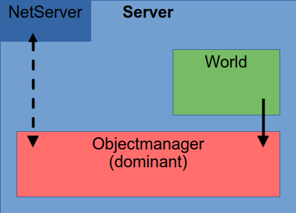
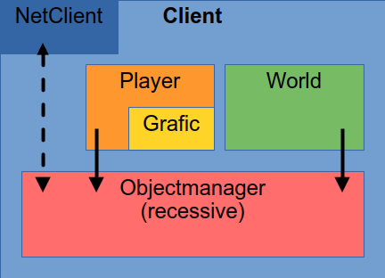
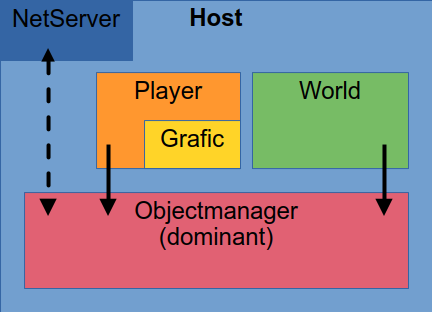
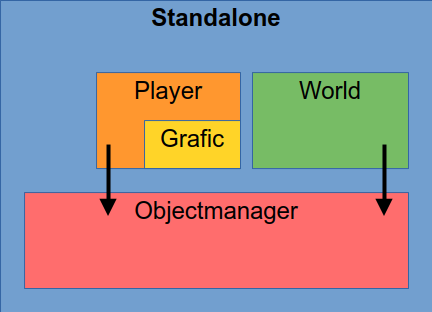
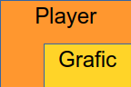
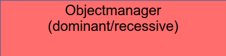
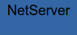
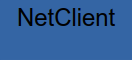

# Graveborn - Structure

## Modes

### Server

### Client

### Host

### Standalone

## Game

### Player

- is responsible for window settings
- is responsible for audio
- collects player input
- tranlates player input to Objectmanager updates
- submits Objectmanager updates
-
### World

- is responsible for npc movement
- is responsible for rewards and score
- calculates nps actions and position updates
- submits Objectmanager updates

### Objectmanager

- is responsible for physics/collision
- hold all entity related data (e.g position, name, health)
- updates entities according to submited updates from
player and/or World
- bundels all submited updates for sync
- can take bundeled updates from other Objecmanagers

If values do not match:
__Recessive__:
- will take values of other Objectmanager

__Dominant__:
- will prepare SyncMessage data (not the message it self)

## Networking

- handle network connection
- sync with others
